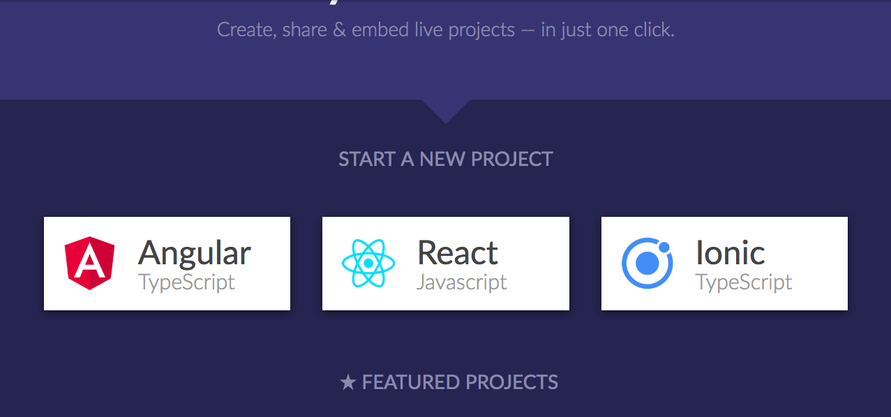
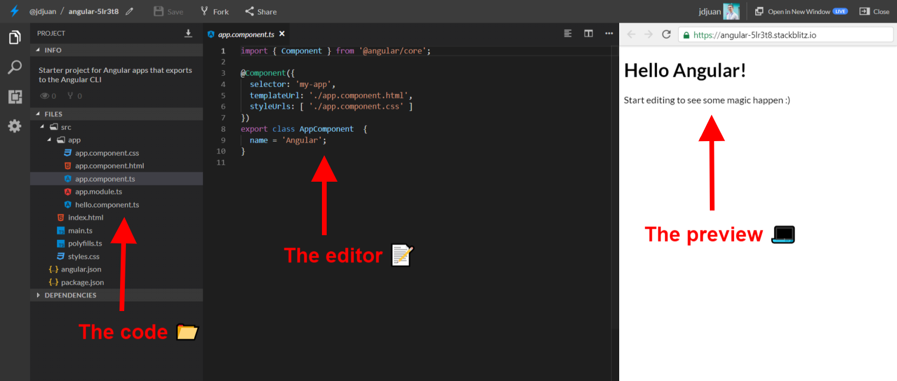

# Your First Angular Application

## 1. Open [Stackblitz.com](https://stackblitz.com/)

[Stackblitz](https://stackblitz.com/) is a platform that allows you to run different applications using **just your browser**.

- ⭐️ You no longer need to install Node, NPM, Yarn or anything!
- ⭐️ Stackblitz is fully supported by Google
- ⭐️ It's even faster than your own terminal

You should see something like this:

## 2. Select Angular

In Stackblitz you can create different kind of projects. In our case we will use Angular.

- Its interface is very similiar to Visual Studio Code
- It has the Angular CLI (an scaffolder) already setup, so you can generate files with just 2 clicks!

## 3. You are ready! Let's start

- Jump from branch to branch to perform the different exercises. ⏰
- If you are interested in carrying out the exercises in your local environment, take a look at this [documentation](https://angular.io/guide/quickstart)

# You are ready to go to [Branch #1](https://github.com/jdjuan/your-first-angular-application/tree/1)
