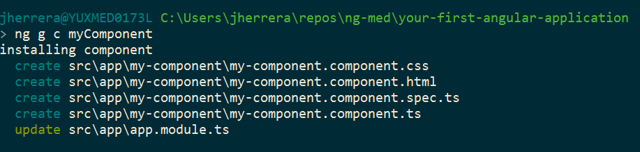

# Your First Angular Application

## Component Creation

So we already applied String Interpolation to our application, now it's time to go a little more in deep. Let's start creating our own component 📦

1. Let's open the terminal and navigate to your application folder
2. Inside run the following command: `$ ng generate component myComponent`
3. You will notice some output where it created 4 files and update one. Take a look at them.

**A component(component.ts) is typically constituted of styles (css), template (html) and tests(specs.ts).**

The **template** holds something like this by default: `
my-component works!
`

4. Now, let's open our component: `my-component.component.ts`
5. Pay attention to the selector tag, it should be something like: `app-my-component`

> The `selector` is the tag you can use to render your component inside another template. 

So now that we know our component tag we can use it inside our app component (**the original component we worked on**).

6. Go to `app.component.html` and add this next to the `h1` tags: `<app-my-component></app-my-component>`
7. Check your app in the browser! 💕

## You are done, now go to [Branch #3](https://github.com/jdjuan/your-first-angular-application/tree/3)
