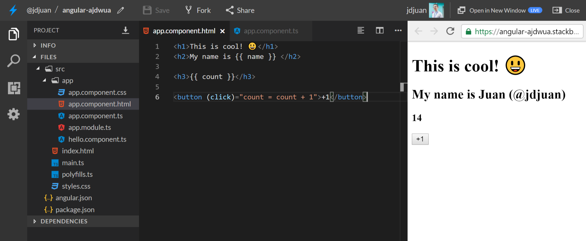

# Your First Angular Application

## 1. String interpolation

Your application should be already running and working 👌. Now it's time to start making some changes:

One cool feature of Angular is called **string interpolation**. It allows you to bind your variables to your template. So let's start:

1. Go to your `app.component.html` file and replace **all its content** with: `<h1>This is cool! 😃</h1>`
2. Save the file and check the results. It should work straight away!
3. Now, go to `app.component.ts` and find the `name` variable
4. Replace its contents with something like: `'Juan'`
5. Finally go back to `app.component.html` and add this:

```html
<h1>This is cool! 😃</h1>
<h2>My name is {{ name }} </h2>
```

8. Save the file and check the result rendered automatically in the browser 👌👌👌

Make sure your name is there! 💕 Try with more variables!



## You are done, now go to [Branch #2](https://github.com/jdjuan/your-first-angular-application/tree/2#your-first-angular-application)
